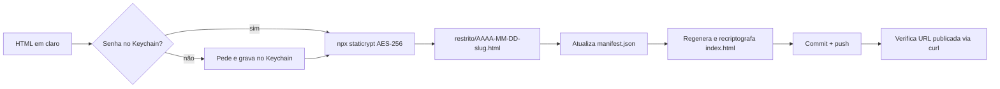

# Área restrita para relatórios HTML em trocado.com.br

Data: 2026-07-07
Status: aprovado pelo Leandro em 2026-07-07

## Problema

O Leandro gera relatórios pessoais em HTML (uso do Claude, finanças pessoais agregadas, leituras) e quer um lugar único para consultá-los depois, de qualquer dispositivo, sem torná-los públicos. O site trocado.com.br já está no ar via GitHub Pages (repo público `trocado/trocado.github.io`, deploy por GitHub Actions) e deve ser aproveitado.

## Restrições técnicas que moldam a solução

1. GitHub Pages é hospedagem estática: não há servidor para validar senha ou captcha. Tela de senha só em JavaScript é decorativa.
2. O repositório é público: qualquer arquivo commitado em claro é legível direto no GitHub, independente de proteção na página.
3. Conclusão: a criptografia precisa acontecer na máquina local, antes do commit. O que sobe para o git é apenas o blob criptografado.

## Decisões

- **Mecanismo**: criptografia client-side com StatiCrypt (AES-256), rodado via `npx` sem dependência instalada no projeto. A senha digitada no navegador é a chave de descriptografia.
- **Captcha**: cortado. Sem servidor não há validação real; o ataque relevante é brute-force offline contra o blob, onde captcha não existe. A defesa é a força da passphrase.
- **Senha**: uma senha-mestre única (passphrase recomendada de 4 ou mais palavras), guardada no Keychain do macOS (serviço `trocado-restrito`). A skill de publicação lê de lá.
- **Sensibilidade aceita**: baixa (relatórios pessoais). Nada de dados do Serpros, pessoas ou fornecedores nessa área.

## Estrutura

```
restrito/                          → https://trocado.com.br/restrito/
  index.html                       → índice criptografado (lista de relatórios)
  AAAA-MM-DD-slug.html             → cada relatório, criptografado
  manifest.json                    → metadados em claro (slug, data, título)
.staticrypt.json                   → salt compartilhado (commitável, salt não é segredo)
_restrito-src/                     → fontes em claro, listada no .gitignore
```

- O salt compartilhado entre todos os arquivos habilita o "lembrar neste navegador por 30 dias": senha digitada uma vez no índice vale para os relatórios.
- `manifest.json` fica em claro porque os nomes de arquivo já são públicos no repo. Regra: títulos neutros, nunca reveladores.

## Skill `/publica-relatorio`

Fluxo ao publicar um relatório:

1. Recebe caminho do HTML em claro e título opcional.
2. Lê a senha do Keychain (`security find-generic-password -s trocado-restrito -w`); se não existir, pede ao Leandro e grava (`security add-generic-password`).
3. Criptografa via `npx staticrypt` com salt compartilhado, remember de 30 dias e template customizado, gerando `restrito/AAAA-MM-DD-slug.html`.
4. Atualiza `manifest.json`, regenera o `index.html` do índice a partir do manifest e o recriptografa.
5. Commita e pusha (o workflow `deploy-pages.yml` existente publica).
6. Verifica com `curl` que a URL publicada responde com a tela de senha, não com o conteúdo em claro.



## Tela de senha e índice

- Template do StatiCrypt customizado: PT-BR, fundo dark, tipografia Space Grotesk, acentos lime/cyan, coerente com a identidade VECTOR do site.
- Índice descriptografado: lista com data, título e link de cada relatório.
- Meta `noindex` no template e `robots.txt` com `Disallow: /restrito/` (cosmético; o conteúdo já está criptografado).

## Modelo de segurança (limites explícitos)

- Proteção equivale à força da senha; brute-force offline é possível para quem baixar o blob.
- Nomes de arquivo e a existência da área são públicos; o conteúdo não.
- O histórico do git preserva tudo que já foi publicado: trocar a senha no futuro não reprotege arquivos antigos.
- Sem revogação por usuário: quem tem a senha lê tudo. Aceitável para relatórios pessoais de baixa sensibilidade.

## Critério de sucesso

1. `https://trocado.com.br/restrito/` no ar exigindo senha.
2. Senha correta abre o índice; senha errada não abre.
3. Nenhum HTML de relatório em claro no histórico do git (`_restrito-src/` ignorada).
4. Um relatório real publicado ponta a ponta pela skill, navegável a partir do índice.
5. Com "lembrar neste navegador" ativo, abrir um segundo relatório não pede senha de novo.

## Fora de escopo

- Captcha e rate-limiting (sem servidor, sem efeito).
- Autenticação por usuário, revogação, auditoria de acesso.
- Relatórios de sensibilidade média ou alta (esses não entram nessa área).
- Cloudflare Access ou migração de hospedagem.
